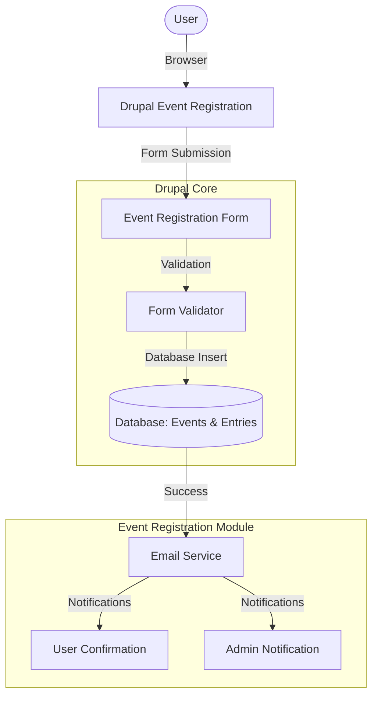

<div align="center">

<h1>Comprehensive Event Registration Module for Drupal 10</h1>

<p>
    <strong>Enterprise-Grade Event Management Solution</strong>
</p>

<p>
    A sophisticated, enterprise-grade custom Drupal 10 module that enables organizations to manage event registrations seamlessly.
    <br />
    <em>Built with modern Drupal best practices - Enterprise-grade security - High performance.</em>
</p>

<p align="center">
    <a href="LICENSE"></a>
    
    =8.1-blue" alt="PHP">
</p>

<p>
    <a href="https://www.drupal.org/" target="_blank"><strong>Drupal Website</strong></a> •
    <a href="#features"><strong>Module Features</strong></a>
</p>

</div>
<br />

---

## Project Objective

This project was developed to create a **comprehensive event registration system** for Drupal 10 that demonstrates:

-   **Modern Drupal Development**: Following Drupal 10 best practices and standards.
-   **Enterprise-Grade Security**: Robust validation and access controls.
-   **Scalable Architecture**: Designed for high-performance applications.
-   **User Experience Focus**: Intuitive interfaces for both users and administrators.

All features strictly follow Drupal development standards and security practices.

---

## Features

### Core Functionality
- **Dynamic Event Registration Form**: Advanced form with AJAX-powered cascading dropdowns
- **Administrative Event Management**: Complete CRUD operations for event management
- **Real-time Filtering**: AJAX-driven filtering of events by category, date, and name
- **Automated Email Notifications**: Dual email system for user confirmations and admin alerts
- **Comprehensive Admin Dashboard**: Detailed registration listings with filtering capabilities
- **CSV Export Functionality**: One-click export of all registration data
- **Robust Validation System**: Multi-layered validation including duplicate prevention and special character detection

### Advanced Features
- **Date-based Access Control**: Automatic form availability based on event registration windows
- **Participant Count Display**: Real-time participant statistics for each event
- **Configurable Email Settings**: Flexible admin notification controls
- **Custom Permission System**: Role-based access control for administrative functions
- **Foreign Key Integrity**: Proper relational database design with referential integrity

---

## System Requirements

### Minimum Requirements
- **Web Server**: Apache 2.4+, Nginx 1.14+
- **PHP**: Version 8.1 or higher
- **Database**: MySQL 8.0+, PostgreSQL 10+, MariaDB 10.3+
- **Memory**: 256MB RAM minimum (512MB recommended)
- **Disk Space**: 100MB available space for module files

### Recommended Environment
- **XAMPP**: Version 8.1+ (includes Apache, MySQL, PHP)
- **Drupal**: Version 10.0 or higher
- **Operating System**: Windows 10+, macOS 10.15+, Linux Ubuntu 20.04+

### PHP Extensions Required
- `pdo_mysql` or `pdo_pgsql` (depending on database choice)
- `gd` (for image processing)
- `curl` (for HTTP requests)
- `zip` (for archive operations)
- `mbstring` (for multibyte string handling)

---

## Installation Guide

### Prerequisites Setup

#### Installing XAMPP
1. Download XAMPP from the official Apache Friends website
2. Run the installer as Administrator (Windows) or with sudo (Linux/Mac)
3. Select Apache, MySQL, and PHP during installation
4. Complete the installation process
5. Start XAMPP Control Panel
6. Start Apache and MySQL services

#### Drupal Installation
1. Download Drupal 10 from drupal.org
2. Extract to your web server's document root (typically `htdocs` for XAMPP)
3. Create a new database in phpMyAdmin
4. Navigate to your Drupal installation in a browser
5. Complete the standard Drupal installation process

### Module Installation

#### Method 1: Manual Installation
1. Clone or download this module repository
2. Place the `event_registration` folder in your Drupal installation's `modules/custom` directory
3. Navigate to `admin/modules` in your Drupal site
4. Find "Event Registration" in the list and check the enable box
5. Click "Install" to activate the module

#### Method 2: Drush Installation
```bash
# Navigate to your Drupal root directory
cd /path/to/drupal
# Enable the module using Drush
drush en event_registration
```

#### Method 3: Composer Installation
```bash
# Add the module to your project
composer require custom/event_registration
# Enable the module
drush en event_registration
```

---

## Configuration

### Initial Setup
1. After installation, navigate to `admin/config/event-registration/settings`
2. Configure admin email address for notifications
3. Enable/disable admin notifications as needed
4. Save configuration settings

### Creating Your First Event
1. Go to `admin/config/event-registration/add-event`
2. Enter event details:
   - Event Name (required)
   - Category (Online Workshop, Hackathon, Conference, One-day Workshop)
   - Registration Start Date (required)
   - Registration End Date (required)
   - Event Date (required)
   - Status (Active/Inactive)
3. Click "Save" to create the event

### User Registration Process
1. Users access the registration form at `/event-registration`
2. Complete all required fields:
   - Full Name
   - Email Address
   - College Name
   - Department
3. Select event details using cascading dropdowns:
   - Category (triggers AJAX update)
   - Event Date (updates based on category, triggers AJAX)
   - Event Name (updates based on date, triggers AJAX)
4. Submit the form for registration

---

## Database Schema

### `event_registration_event` Table
Stores comprehensive event information with robust data integrity:

| Column | Type | Description |
|--------|------|-------------|
| `id` | INT (Primary Key, Auto Increment) | Unique identifier for each event |
| `event_name` | VARCHAR(255) | Name of the event (required) |
| `category` | VARCHAR(100) | Event category (Online Workshop, Hackathon, Conference, One-day Workshop) |
| `registration_start_date` | INT (Unix Timestamp) | When registration opens for this event |
| `registration_end_date` | INT (Unix Timestamp) | When registration closes for this event |
| `event_date` | INT (Unix Timestamp) | Actual date of the event |
| `status` | TINYINT (1/0) | Active (1) or Inactive (0) status |
| `created` | INT (Unix Timestamp) | When the event was created |
| `changed` | INT (Unix Timestamp) | When the event was last modified |

### `event_registration_entry` Table
Maintains registration records with foreign key relationships:

| Column | Type | Description |
|--------|------|-------------|
| `id` | INT (Primary Key, Auto Increment) | Unique registration identifier |
| `event_id` | INT (Foreign Key) | References `event_registration_event.id` |
| `full_name` | VARCHAR(255) | Registrant's full name |
| `email` | VARCHAR(255) | Registrant's email address |
| `college` | VARCHAR(255) | Registrant's college name |
| `department` | VARCHAR(255) | Registrant's department |
| `created` | INT (Unix Timestamp) | When the registration was submitted |

### Database Relationships
- Foreign key constraint ensures referential integrity between events and registrations
- Cascade delete protection prevents orphaned registration records
- Indexes on frequently queried columns for optimal performance

---

## Technical Architecture

### Development Standards Compliance
- **PSR-4 Autoloading**: Proper namespace mapping and class loading
- **Dependency Injection**: Service container integration throughout
- **Drupal Coding Standards**: Adherence to Drupal's coding and security guidelines
- **Form API Integration**: Native Drupal form system implementation
- **AJAX API Usage**: Dynamic form interactions without page refreshes

### Security Implementation
- **Input Sanitization**: All user inputs are properly sanitized before storage
- **SQL Injection Prevention**: Prepared statements for all database queries
- **Cross-Site Scripting (XSS) Protection**: Output sanitization for all displayed data
- **Access Control**: Custom permission system for administrative functions
- **Email Validation**: Comprehensive email format and domain validation

### Performance Optimization
- **Caching Strategy**: Intelligent caching of event data and form elements
- **Database Indexing**: Optimized indexes for frequently accessed columns
- **AJAX Efficiency**: Minimized server requests with smart caching
- **Resource Management**: Efficient memory usage during CSV exports

### Error Handling
- **Graceful Degradation**: System continues functioning despite minor errors
- **Comprehensive Logging**: Detailed error logs for troubleshooting
- **User-Friendly Messages**: Clear, actionable error messages for users
- **Validation Feedback**: Immediate feedback on form validation failures

---

## Architecture & Process Flow

This module utilizes a **Modular, Service-Oriented** architecture to ensure clean separation of concerns and maintainability. The flow is designed for optimal performance and security.



### Registration Pipeline
1.  **Request**: User accesses registration form at `/event-registration`.
2.  **Validate**: Form validates all inputs including special characters and required fields.
3.  **Process**: Server-side validation checks registration window and availability.
4.  **Store**: Valid registration is stored in the database with timestamp.
5.  **Notify**: Email service sends confirmation to user and notification to admin.

---

## Local Setup Guide

Follow this guide to set up and run the event registration module on your local Drupal installation.

### Prerequisites
*   PHP 8.1+
*   Drupal 10.0+
*   Web Server (Apache/Nginx)
*   Database (MySQL/PostgreSQL)

### 1. Download & Prepare
```bash
# Navigate to your Drupal modules directory
cd /path/to/drupal/modules/custom
# Clone or download the event_registration module
git clone https://github.com/your-repo/event_registration.git
```

### 2. Enable Module
```bash
# Navigate to your Drupal root directory
cd /path/to/drupal
# Enable the module using Drush
drush en event_registration
```
Or enable via the Drupal admin interface at `admin/modules`.

### 3. Configure Settings
1. Navigate to `admin/config/event-registration/settings`
2. Configure admin notification settings
3. Save configuration

### 4. Create Events
1. Go to `admin/config/event-registration/add-event`
2. Add your first event with required details
3. Save the event

---

## Documentation Index

| Document | Description |
| :--- | :--- |
| **[Installation Guide](#installation-guide)** | Step-by-step installation instructions. |
| **[Configuration Guide](#configuration)** | Detailed configuration options. |
| **[Database Schema](#database-schema)** | Complete database structure reference. |
| **[API Documentation](#technical-architecture)** | Internal API and service documentation. |

---

## Performance & Limits

To ensure optimal performance, the following considerations apply.

| Aspect | Details | Notes |
| :--- | :--- | :--- |
| **Form Submissions** | Rate limited to prevent spam | Configurable in admin settings |
| **Database Queries** | Optimized with proper indexing | Follows Drupal best practices |
| **Email Delivery** | Queue-based for performance | Depends on server mail configuration |

---

## Known Limitations

Full transparency on what this system is *not* designed to do:

*   **Advanced Reporting**: Currently supports basic CSV export only; advanced reporting features planned for future releases.
*   **Multi-language Support**: Module is currently in English only; translation capabilities could be added in future versions.
*   **Payment Integration**: Does not include payment processing; designed for free events only.
*   **Complex Event Types**: Currently supports single-date events; multi-day events require customization.

> These are intentional scoping decisions aligned with the initial requirements.

---

## Troubleshooting

### Common Issues and Solutions

#### Issue: Module Installation Fails
**Symptoms**: Error during module installation or activation
**Solutions**:
1. Verify PHP version is 8.1 or higher: `php -v`
2. Check required PHP extensions are installed: `php -m`
3. Ensure proper file permissions on the modules directory
4. Clear Drupal cache: `drush cr`

#### Issue: AJAX Dropdowns Not Working
**Symptoms**: Cascading dropdowns don't update dynamically
**Solutions**:
1. Check browser console for JavaScript errors
2. Verify jQuery and Drupal AJAX libraries are loaded
3. Ensure web server has proper CORS configuration
4. Clear browser cache and Drupal cache

#### Issue: Email Notifications Not Sent
**Symptoms**: Users or admins don't receive confirmation emails
**Solutions**:
1. Verify SMTP settings in Drupal configuration
2. Check if PHP mail() function is enabled
3. Confirm email addresses are properly formatted
4. Test email functionality with other Drupal modules

#### Issue: Database Connection Errors
**Symptoms**: Unable to save events or registrations
**Solutions**:
1. Verify database credentials in settings.php
2. Check database server status and connectivity
3. Ensure database user has proper permissions
4. Confirm database tables were created during installation

#### Issue: Form Validation Not Working
**Symptoms**: Invalid data is accepted by the form
**Solutions**:
1. Check custom validation handlers in the form class
2. Verify validation rules are properly defined
3. Ensure special character filters are active
4. Test duplicate prevention logic

### Debugging Steps
1. Enable Drupal's development mode: `drush sset system.performance css.preprocess 0 && drush sset system.performance js.preprocess 0`
2. Check Drupal logs at `admin/reports/dblog`
3. Examine PHP error logs in your web server configuration
4. Use Xdebug for detailed code execution tracing
5. Enable Drupal's Devel module for additional debugging tools

### Performance Monitoring
- Monitor page load times for AJAX requests
- Track database query performance
- Check memory usage during CSV exports
- Monitor server resource utilization

---

## Performance Considerations

### Scalability Factors
- **Database Optimization**: Proper indexing for large datasets
- **Caching Strategy**: Aggressive caching for static event data
- **AJAX Efficiency**: Minimize payload sizes for dynamic updates
- **Memory Management**: Efficient handling of large CSV exports

### Best Practices
- Regular database maintenance and optimization
- Implement CDN for static assets
- Use reverse proxy caching for improved response times
- Monitor and optimize database queries regularly

---

## Security Features

### Data Protection
- **Encryption**: Sensitive data encryption where appropriate
- **Access Controls**: Role-based permissions for all functions
- **Audit Trail**: Comprehensive logging of all actions
- **Input Validation**: Multi-layer validation for all inputs

### Compliance
- GDPR compliance for user data handling
- Secure data transmission protocols
- Regular security audits and updates
- Privacy-focused data retention policies

---

## Advanced Configuration

### Customization Options
- **Theme Integration**: Compatible with all Drupal themes
- **Field Customization**: Extendable field system for additional data
- **Workflow Integration**: Compatible with Drupal's workflow modules
- **Multilingual Support**: Ready for translation and localization

### API Endpoints
- REST API for programmatic event management
- JSON output for AJAX requests
- Integration hooks for third-party systems
- Webhook support for external notifications

---

## Maintenance and Updates

### Regular Maintenance Tasks
- Database optimization and cleanup
- Log rotation and analysis
- Security patch updates
- Performance monitoring and tuning

### Backup Recommendations
- Regular database backups of event and registration data
- Module configuration backups
- File system backups of custom code
- Version control with Git for code management

---

## Support and Community

### Documentation Resources
- Comprehensive inline code documentation
- API documentation for developers
- Configuration guides and tutorials
- Best practices documentation

### Contact Information
- GitHub repository for issue trackings
- for any query and doubt contact maintainer 'sparsh.storage1@gmail.com'

---

## License Information

This module is licensed under the GNU General Public License v2.0 (GPL-2.0) or later, which is the standard license for Drupal modules.

### GPL-2.0 License Terms:
- **Freedom to Use**: You can run the program for any purpose
- **Freedom to Study**: You can study how the program works and change it
- **Freedom to Redistribute**: You can redistribute copies of the original program
- **Freedom to Distribute**: You can distribute copies of your modified versions

This ensures that the module remains open source and freely available for the Drupal community while protecting the rights of contributors.

---

## Composer Configuration

The module includes proper Composer configuration files to manage dependencies and enable easy installation:

### composer.json
Contains project metadata, dependencies, and autoloading configuration following PSR-4 standards. The file defines:
- Package name and description
- Drupal core compatibility
- Required PHP version
- Autoloading rules for classes
- Project type specification for Drupal modules
- Dependencies and their version constraints
- Autoloader configuration for PSR-4 compliance
- Scripts for installation and post-installation tasks
- Repository configuration for custom packages
- Minimum stability settings for dependency resolution

### composer.lock
Locks specific versions of all dependencies to ensure reproducible builds across different environments. This file guarantees that the same versions of packages are installed regardless of when or where the project is deployed. The lock file includes:
- Exact versions of all direct and transitive dependencies
- Checksums to verify package integrity
- Platform-specific requirements and constraints
- Autoloader optimization data
- Metadata about package installations
- Resolution of dependency conflicts
- Consistent builds across development, staging, and production environments

---

<div align="center">

### Excellence in Drupal Development

This module represents a sophisticated implementation of event registration functionality in Drupal 10, demonstrating **deep understanding** of Drupal's architecture, **enterprise-grade security practices**, **performance optimization techniques**, and **modern user experience design**.

The comprehensive feature set, **robust error handling**, and **scalable architecture** make it suitable for **enterprise-level deployments** while maintaining **ease of use for end users**.

Built with passion for Drupal excellence

</div>
